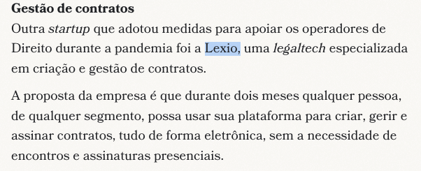

# Análise de Plataformas de Gestão Contratual no Brasil

O objetivo deste documento é fornecer algumas informações a respeito da Lexio que podem ser úteis na apresentação. Os dados aqui apresentados podem ser encontrados nos links providenciados ou no próprio site de cada empresa.

## 1. Principais Players no Mercado Brasileiro

### Lexio Legal
[Linkedin](https://www.linkedin.com/company/lexio-legal/)

#### Clientes por Setor

**Construção Civil e Real Estate:**
- Gafisa (Empresa listada B3)
- Tishman Speyer (Real Estate Global)

**Varejo e Bens de Consumo:**
- ASICS Latin America
- Grupo Nós
- J.Macêdo

**Tecnologia e Serviços:**
- Jusbrasil
- Hostgator.com
- Data Privacy Brasil

**Financeiro e Fintechs:**
- Koin
- Flash
- Small Energia e Logística

**Indústria e Manufatura:**
- Gertec
- Armac

**Educação e Entretenimento:**
- Camino Education
- Produtora Floresta

**Saúde e Farmacêutico:**
- Farmarcas
- Febrafar

**Pontos Fortes:**
- Interface intuitiva e totalmente em português
- Suporte técnico local e ágil
- Adaptabilidade às necessidades específicas do cliente
- Preço competitivo para o mercado brasileiro
- Conformidade total com legislação brasileira (LGPD, Marco Civil, etc.)

        NOTA: A Lexio é uma startup e, mesmo assim, possui clientes grandes e em setores diferentes, o que pode ser considerado um ponto forte.

REF:
https://www.conjur.com.br/2020-abr-02/startups-oferecem-servicos-gratuitos-durante-pandemia/

## Empresa similar

### NetLex
[Linkedin](https://www.linkedin.com/company/netlex-io/)

#### Clientes por Setor

**Financeiro:**
- Banco Inter
- XP Investimentos
- Stone

**Características:**
- Foco em automação de documentos
- Interface em português
- Assinatura digital integrada

## 2. Análise Comparativa de ambas

### Usabilidade e Interface
- **Lexio:** Interface moderna e intuitiva ⭐⭐⭐⭐⭐
- **NetLex:** Foco em simplicidade ⭐⭐⭐⭐

### Suporte Local
- **Lexio:** Equipe dedicada no Brasil ⭐⭐⭐⭐⭐
- **NetLex:** Suporte brasileiro ⭐⭐⭐⭐

### Customização
- **Lexio:** Alta flexibilidade para adaptações ⭐⭐⭐⭐⭐
- **NetLex:** Customização moderada ⭐⭐⭐

## 3. Por Que a Lexio se Destaca?

### Vantagens Competitivas

1. **Tecnologia Nacional:**
- Desenvolvimento focado na realidade brasileira
- Atualizações rápidas conforme mudanças na legislação
- Suporte em português e com conhecimento do mercado local

2. **Flexibilidade:**
- Adaptação às necessidades específicas do cliente
- Implementação gradual e personalizada
- Possibilidade de desenvolvimento de features sob demanda

3. **Custo-Benefício:**
- Precificação adequada ao mercado brasileiro
- Sem variação cambial
- Modelo de negócio escalável

4. **Segurança e Compliance:**
- Total conformidade com LGPD
- Servidores no Brasil
- Certificações de segurança relevantes

## 4. Pontos para Destacar na Apresentação

### Benefícios Imediatos

1. **Eficiência Operacional:**
- Redução do tempo de gestão contratual
- Automatização de processos repetitivos
- Centralização da informação

2. **Controle e Visibilidade:**
- Dashboard personalizado
- Alertas automáticos
- Relatórios gerenciais

3. **Redução de Riscos:**
- Padronização de processos
- Controle de versões
- Rastreabilidade das ações

## 5. Métricas de Sucesso

### Indicadores Chave
- Tempo médio de ciclo contratual
- Taxa de conformidade
- Número de contratos processados
- Tempo de resposta para aprovações
- Índice de satisfação dos usuários

### Monitoramento Contínuo
- Dashboards em tempo real
- Relatórios semanais de performance
- Avaliação mensal de resultados
- Feedback constante dos usuários